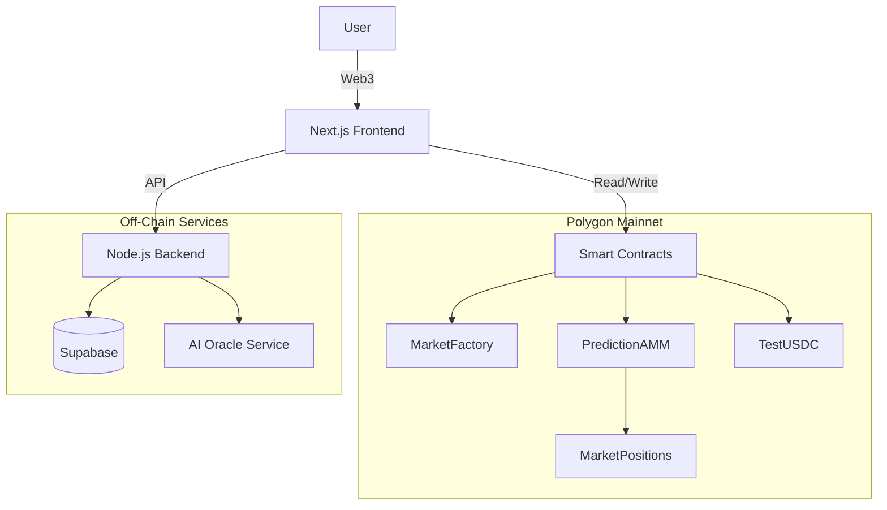

# 🔮 OracleX - Decentralized Prediction Market

> **Live on Polygon Mainnet** 🚀
> 
> A next-generation prediction market platform combining DeFi, AMM, and AI Oracles.

[](https://opensource.org/licenses/MIT)
[](https://polygon.technology/)
[](https://nextjs.org/)

## 🌟 Overview

OracleX represents the future of decentralized forecasting. By leveraging **Polygon Mainnet** for fast execution and low fees, and **AI Oracles** for reliable settlement, we enable users to trade on the outcome of any future event with confidence.

**⚠️ Current Status: Beta on Mainnet**
This deployment is for product/security validation using TestUSDC and should not be treated as production real-value markets.

### Key Features

- 🎯 **Prediction Markets** - Create and trade on sports, crypto, politics, and more.
- 🤖 **AI Oracle Integration (Beta)** - Markets use commitment + proof verification flows; advanced attestation paths are staged for future releases.
- 💰 **AMM Trading** - Constant Product Market Maker (CPMM) ensures instant liquidity.
- 💸 **Beta Economics** - Integrated TestUSDC flow for risk-free protocol testing on Mainnet.
- 📊 **Real-time Analytics** - Live positions, PL tracking, and market trends.

---

## 🚀 Getting Started (Beta Mode)

Follow these steps to run the application locally and interact with the live contracts on Polygon Mainnet.

### 1. Prerequisites
- Node.js 20+
- MetaMask Wallet (connected to Polygon Mainnet)
- Small amount of MATIC for gas fees (it's Mainnet!)

### 2. Installation

```bash
git clone https://github.com/ayushsaklani-min/Prediction-market.git
cd Prediction-market/oraclex

# Install backend/root dependencies
npm install

# Install frontend dependencies
cd frontend-v2
npm install
cd ..
```

### 3. Claim TestUSDC
To trade, you need **TestUSDC**. The contract is mintable!

**Option A: Import Existing Balance (Deployer)**
- **Address**: `0x6aFC2AD966a9DbB7D595D54F81AC924419f816c6`
- **Symbol**: `USDC`
- **Decimals**: `6`
- *Note: If you are the deployer, you already have 100M TestUSDC.*

**Option B: Mint New Tokens**
You can interact with the contract on [PolygonScan](https://polygonscan.com/address/0x6aFC2AD966a9DbB7D595D54F81AC924419f816c6#writeContract) using the `mint` function to get free TestUSDC.

### 4. Run Locally
Start both the backend API and frontend application:

**Terminal 1 (Backend):**
```bash
npm run start:backend
```
> Runs on `http://localhost:4000`

**Terminal 2 (Frontend):**
```bash
npm run start:frontend
```
> Runs on `http://localhost:3000`

### 5. One-Click Local Demo
```bash
npm run demo:local
```
This starts a local Hardhat node, deploys contracts, seeds demo markets, and launches backend/frontend.

---

## 📋 Smart Contracts (Polygon Mainnet)

These contracts are deployed and live.

| Contract | Address | Description |
|----------|---------|-------------|
| **TestUSDC** | [`0x6aFC...6c6`](https://polygonscan.com/address/0x6aFC2AD966a9DbB7D595D54F81AC924419f816c6) | Mock currency for testing |
| **MarketFactory** | [`0xfCD1...3dEf`](https://polygonscan.com/address/0xfCD154BD714f4b9DDd271B8bdD1fF3d427333dEf) | Creates new markets |
| **PredictionAMM** | [`0xAD8d...4213`](https://polygonscan.com/address/0xAD8dC6ca24038Af23E2f2Ea7A07B588cF04F4213) | Trading engine (CPMM) |
| **MarketPositions**| [`0xA2B9...c2fE`](https://polygonscan.com/address/0xA2B9d3C0557b344bc475fc0c0aCC2a25C74Fc2fE) | ERC1155 Outcome Shares |
| **VerifierV2** | [`0xd619...2a7`](https://polygonscan.com/address/0xd619b6C8c24fBcC1A764B4e11175DB7B8Caad2a7) | Verifies market results |
| **OracleAdapter** | [`0xd452...0c10`](https://polygonscan.com/address/0xd45284283A8D0BDD15728859B12E9EBBF2630c10) | Interfaces with AI Oracle |
| **Treasury** | [`0x9F27...0664`](https://polygonscan.com/address/0x9F275918503c4fdABe4FE2BF6365EeE6D2De0664) | Collects protocol fees |
| **ORXToken** | [`0x1D23...6bD`](https://polygonscan.com/address/0x1D2306f42DB68Ac09d1305b98C63ca3F997076bD) | Governance Token |

---

## 🏗️ Architecture



## 🛠️ Tech Stack

- **Blockchain**: Polygon Mainnet (Solidity 0.8.24)
- **Framework**: Hardhat (Deployment & Testing)
- **Frontend**: Next.js 15, TypeScript, TailwindCSS, Wagmi/Viem
- **Backend**: Node.js, Express, Supabase
- **Oracle**: Custom AI-driven resolution mechanism

## 📄 License
MIT License.

## 📚 Security Docs
- `docs/ARCHITECTURE_AND_THREAT_MODEL.md`
- `docs/ROLE_MATRIX_AND_EMERGENCY_RUNBOOK.md`


