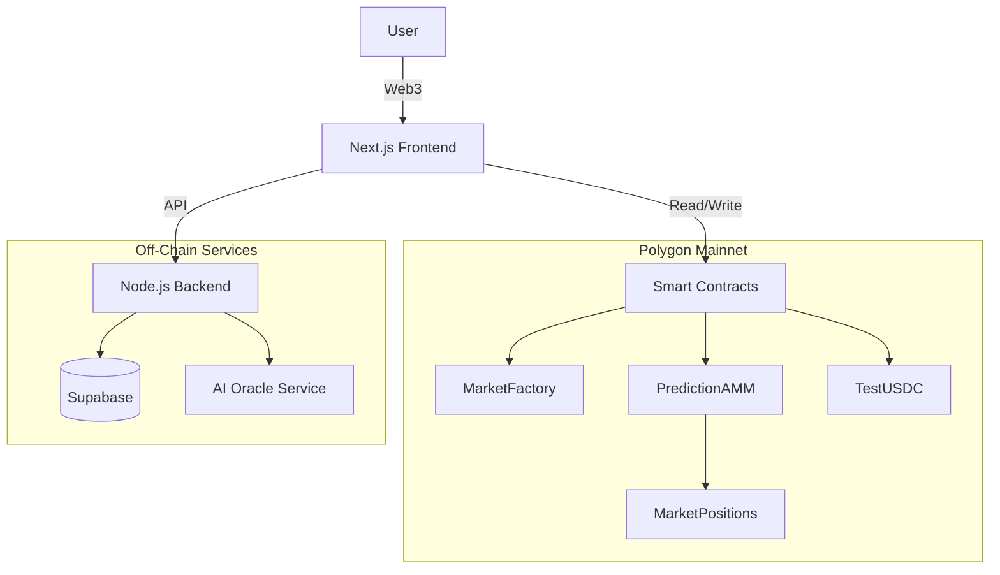

# 🔮 OracleX - Decentralized Prediction Market

> **Live on Polygon Mainnet (Test Mode)** 🚀
> 
> A next-generation prediction market platform combining DeFi, AMM, and AI Oracles.

[](https://opensource.org/licenses/MIT)
[](https://polygon.technology/)
[](https://nextjs.org/)

## 🌟 Overview

OracleX represents the future of decentralized forecasting. By leveraging **Polygon Mainnet** for speed and low fees, and **AI Oracles** for reliable settlement, we enable users to trade on the outcome of any future event with confidence.

**⚠️ Current Status: Test Mode on Mainnet**
The protocol is deployed on Polygon Mainnet but configured to use a **TestUSDC** token. This allows you to test the full "Mainnet Experience" (wallets, block times, gas) without risking real capital.

### Key Features

- 🎯 **Prediction Markets** - Create and trade on sports, crypto, politics, and more.
- 🤖 **AI Oracle Integration** - Markets are resolved automatically by AI agents (with dispute fallback).
- 💰 **AMM Trading** - Constant Product Market Maker (CPMM) ensures instant liquidity.
- 💸 **Test Mode** - Integrated TestUSDC faucet for risk-free testing on Mainnet.
- 📊 **Real-time Analytics** - Live positions, PL tracking, and market trends.

---

## 🚀 Getting Started (Test Mode)

Follow these steps to run the application locally and interact with the live contracts on Polygon Mainnet.

### 1. Prerequisites
- Node.js 18+
- MetaMask Wallet (connected to Polygon Mainnet)
- Small amount of MATIC for gas fees (it's Mainnet!)

### 2. Installation

```bash
git clone https://github.com/ayushsaklani-min/Prediction-market.git
cd Prediction-market/oraclex

# Install backend/root dependencies
npm install

# Install frontend dependencies
cd frontend-v2
npm install
cd ..
```

### 3. Claim TestUSDC
To trade, you need **TestUSDC**. The contract is mintable!

**Option A: Import Existing Balance (Deployer)**
- **Address**: `0x6aFC2AD966a9DbB7D595D54F81AC924419f816c6`
- **Symbol**: `USDC`
- **Decimals**: `6`
- *Note: If you are the deployer, you already have 100M TestUSDC.*

**Option B: Mint New Tokens**
You can interact with the contract on [PolygonScan](https://polygonscan.com/address/0x6aFC2AD966a9DbB7D595D54F81AC924419f816c6#writeContract) using the `mint` function to get free TestUSDC.

### 4. Run Locally
Start both the backend API and frontend application:

**Terminal 1 (Backend):**
```bash
npm run start:backend
```
> Runs on `http://localhost:4000`

**Terminal 2 (Frontend):**
```bash
npm run start:frontend
```
> Runs on `http://localhost:3000`

---

## 📋 Smart Contracts (Polygon Mainnet)

These contracts are deployed and live.

| Contract | Address | Description |
|----------|---------|-------------|
| **TestUSDC** | [`0x6aFC...6c6`](https://polygonscan.com/address/0x6aFC2AD966a9DbB7D595D54F81AC924419f816c6) | Mock currency for testing |
| **MarketFactory** | [`0x34a4...58E`](https://polygonscan.com/address/0x34a4d275549F4B243427793d7dd07A3DC8b7358E) | Creates new markets |
| **PredictionAMM** | [`0xB1B6...81A`](https://polygonscan.com/address/0xB1B67563960fDD68BadeEb769Bf9b5A3D39aa81A) | Trading engine (CPMM) |
| **MarketPositions**| [`0xfD93...01A`](https://polygonscan.com/address/0xfD93dAEc67a0a34Ae7eABd2Bde8D58710245001A) | ERC1155 Outcome Shares |
| **VerifierV2** | [`0x862e...0Ca`](https://polygonscan.com/address/0x862eD35DBA824AfB27564d8ad3A3D7cF1302D0Ca) | Verifies market results |
| **OracleAdapter** | [`0x695B...517`](https://polygonscan.com/address/0x695Bb36D976629E6d46C8E1E1De24C1dCD4Fa517) | Interfaces with AI Oracle |
| **Treasury** | [`0xEB0F...fc5`](https://polygonscan.com/address/0xEB0F09C0817F75Be039275f3E3C93CdAc3FF3fc5) | Collects protocol fees |
| **ORXToken** | [`0x1D23...6bD`](https://polygonscan.com/address/0x1D2306f42DB68Ac09d1305b98C63ca3F997076bD) | Governance Token |

---

## 🏗️ Architecture



## 🛠️ Tech Stack

- **Blockchain**: Polygon Mainnet (Solidity 0.8.24)
- **Framework**: Hardhat (Deployment & Testing)
- **Frontend**: Next.js 15, TypeScript, TailwindCSS, Wagmi/Viem
- **Backend**: Node.js, Express, Supabase
- **Oracle**: Custom AI-driven resolution mechanism

## 📄 License
MIT License.
